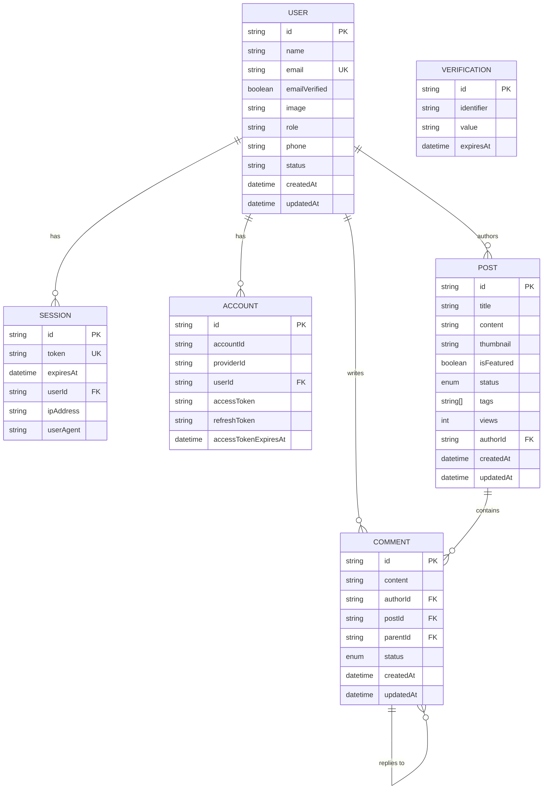

# Papertrail Server

<div align="center">
  
  <p><em>A robust backend server for a modern blog and content management system.</em></p>
</div>

---

## Features

- **User Authentication**: Secure authentication powered by [Better-Auth](https://better-auth.com/).
- **Post Management**: Full CRUD operations for blog posts with support for tags, featured posts, and drafts.
- **Commenting System**: Interactive comments with nested replies (threading) and moderation control.
- **Admin Tools**: Built-in scripts for seeding admin accounts.
- **Type Safety**: Fully written in TypeScript with Prisma for end-to-end type safety.
- **Email Integration**: Integrated with Nodemailer for system notifications.

---

## Client Repository

The frontend client for this project is available at:
[https://github.com/amisadman/papertrail-client](https://github.com/amisadman/papertrail-client)


---

## Database Design

Below is the Entity-Relationship Diagram (ERD) representing the database structure:



---


## Tech Stack

- **Runtime**: [Node.js](https://nodejs.org/)
- **Framework**: [Express.js](https://expressjs.com/)
- **ORM**: [Prisma](https://www.prisma.io/)
- **Database**: [PostgreSQL](https://www.postgresql.org/)
- **Language**: [TypeScript](https://www.typescriptlang.org/)
- **Auth**: [Better-Auth](https://better-auth.com/)
- **Logging**: [Morgan](https://github.com/expressjs/morgan)


## Getting Started

### Prerequisites

- [Node.js](https://nodejs.org/) (v18+)
- [pnpm](https://pnpm.io/) (preferred) or npm
- [PostgreSQL](https://www.postgresql.org/) database

### Installation

1. Clone the repository:
   ```bash
   git clone https://github.com/amisadman/papertrail-server.git
   cd papertrail-server
   ```

2. Install dependencies:
   ```bash
   pnpm install
   ```

3. Setup environment variables:
   Create a `.env` file in the root directory and add your configuration (see `.env.example`).

4. Generate Prisma Client:
   ```bash
   npx prisma generate
   ```

5. Run database migrations:
   ```bash
   npx prisma migrate dev
   ```

### Running the Application

- **Development Mode**:
  ```bash
  pnpm run dev
  ```

- **Seed Admin**:
  ```bash
  pnpm run seed:admin
  ```

---
